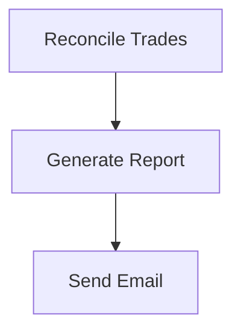

# 🔄 TradeRecon: Real-Time Trade Reconciliation Engine

A streaming post-trade reconciliation system inspired by real-world infrastructure.

---

## 🧠 Problem Statement

In trading firms, multiple systems (internal and external) log the same trade at different times, with slight variations. These include:

- Internal trading engines  
- Broker confirmations  
- Risk/PnL systems  
- Clearinghouses or custodians  

Discrepancies in price, quantity, or timestamp can indicate serious issues: execution errors, data corruption, or compliance violations.

**Goals**

- Reconciling trade records across systems  
- Detecting and flagging mismatches  
- Generating end-of-day compliance reports  
- Ensuring timely alerts and robust downstream reliability

---

## 🎯 Project Goal

To build a real-time, Kafka-driven trade reconciliation engine that compares:

- Execution data from the internal engine  
- Confirmation data from broker systems  
- Optional risk snapshots from the PnL system  

…and flags any mismatches in real-time.

---

## 💡 Use Case and Need

In a fast-paced trading environment, maintaining data integrity across numerous disparate systems is paramount. Even minor variations in trade details can lead to significant financial, operational, or regulatory risks.

**TradeRecon** directly addresses this by providing an automated, real-time mechanism to:

- **Ensure Data Consistency**: Guaranteeing that all internal and external records of a trade align.  
- **Mitigate Risk**: Rapidly identifying potential execution errors, data corruption, or unauthorized activities.  
- **Streamline Compliance**: Automating audit-ready reconciliation reports for regulatory obligations.  
- **Enhance Operational Efficiency**: Reducing manual reconciliation effort and allowing focus on higher-value engineering tasks.

---

## 🔁 Data Flow Architecture


---

## 🗂️ Data Sources

Simulated as Kafka topics (and/or fallback CSVs) for flexible testing:

- `executions`: Primary trade record from the internal trading system.  
- `broker_confirmations`: External confirmation of a trade from brokers.  
- `pnl_snapshot`: Snapshot of PnL impact and commission from the accounting system.

Example entries:

```csv
# executions.csv
trade_id,ticker,quantity,price,timestamp
T001,AAPL,100,190.50,2025-07-26T10:01:23

# broker_confirmations.csv
trade_id,ticker,quantity,price,timestamp
T001,AAPL,100,190.50,2025-07-26T10:01:22.900

# pnl_snapshot.csv
trade_id,pnl_impact,commission
T001,95.00,0.5
```

---

## 📏 Reconciliation Logic

For every matched trade ID across the incoming streams, **TradeRecon** applies the following checks:

- ✅ **Quantity Match**: Exact match between execution and confirmation.  
- ✅ **Price Match**: Must be within a tolerance (e.g., ≤ 0.005).  
- ✅ **Timestamp Match**: Must be within a 100ms drift tolerance.  
- ✅ **PnL Consistency**:  
  ```
  abs(price × quantity - commission - pnl_impact) < 1.0
  ```

**On mismatch:**

- Detailed CLI logging  
- HTML summary report update  
- Persistence to SQLite (audit trail)  
- Prometheus metric updates

---

## 🧰 Tech Stack

| Layer              | Tools                        | Role in Project |
|-------------------|------------------------------|-----------------|
| Stream Transport   | Kafka (`kafka-python`)        | Real-time ingestion |
| Data Persistence   | SQLite + SQLAlchemy           | Audit trail storage |
| Reconciliation Engine | Custom Python + threading   | Core logic for trade comparison |
| Reporting & UI     | Flask + Jinja2                | Dynamic reports and UI |
| Metrics Collection | Prometheus + `prometheus_client` | Export metrics |
| Visualization      | Grafana                       | Monitoring dashboards |
| Alerting           | CLI Logs / (Slack, Email - simulated) | Immediate visibility |
| Containerization   | Docker, docker-compose        | Easy deployment |
| Testing            | Pytest                        | Unit + integration tests |
| Monitoring         | Python `logging`              | Runtime observability |

---

## 🧱 Folder Structure

```
TradeRecon/
├── app/
│   ├── __init__.py
│   ├── consumer.py
│   ├── reconcile.py
│   ├── report_generator.py
│   ├── utils.py
│   └── main.py
├── kafka/
│   └── producer.py
├── data/
│   ├── executions.csv
│   ├── broker_confirmations.csv
│   └── pnl_snapshot.csv
├── reports/
│   └── templates/
│       └── report.html
├── tests/
│   └── test_reconciliation.py
├── prometheus/
│   └── prometheus.yml
├── grafana/
│   ├── provisioning/
│   │   ├── datasources/
│   │   │   └── datasource.yml
│   │   └── dashboards/
│   │       └── dashboard.yml
│   └── dashboards/
│       └── traderecon_dashboard.json
├── Dockerfile
├── docker-compose.yml
├── requirements.txt
└── README.md
```

---

## 🚀 Steps to Run

> **Prerequisites:**  
> Ensure you have Docker + Docker Compose installed.

### 1. Setup Files

- Replace your `docker-compose.yml` with the provided one.
- Create the `prometheus/` directory and add `prometheus.yml`.
- Add `grafana/provisioning/` structure with:
  - `datasources/datasource.yml`
  - `dashboards/dashboard.yml`
- Add `grafana/dashboards/traderecon_dashboard.json`
- Ensure updated `app/main.py` and `app/reconcile.py`

### 2. Clone and Navigate

```bash
git clone https://github.com/OnePunchMonk/TradeRecon
cd TradeRecon
```

### 3. Build and Start

```bash
docker-compose up --build -d
```

Wait ~1–2 minutes for services to fully boot.

### 4. Simulate Trade Data

```bash
docker exec -it traderecon_app python kafka/producer.py
```

Watch logs from `docker-compose` to see processing in real time.

### 5. Access Reconciliation Report

Visit [http://localhost:5000/](http://localhost:5000/)  
- View dynamic reconciliation results  
- Optionally download CSV summary

### 6. Access Grafana Dashboard

Visit [http://localhost:3000/](http://localhost:3000/)

- **Login:**  
  - Username: `admin`  
  - Password: `admin`  
- View the pre-provisioned **TradeRecon Overview** dashboard.


### ⚙️ Current Assumptions & Scaling Targets

#### 📌 Assumptions
- The reconciliation engine currently runs **per incoming trade event** via **Kafka**.
- Input trade data is **simulated using CSV files**, acting as Kafka producers.
- Reconciliation happens **in real-time**, not batch-based.

#### 🧭 Planned Architectural Extension
To improve observability and align with **end-of-day compliance workflows**, the pipeline run can be **automated to start using Apache Airflow** as an **alternative batch processor**, replacing Kafka for time-triggered execution.

We propose a **hybrid horizontal architecture**:
- Support **both Kafka (real-time)** and **Airflow (batch)** backends.
- Introduce a boolean field `reconciled` to the data schema, ensuring **duplicate trades or already-matched entries are skipped** in the batch pipeline.

#### 🚧 Scaling Bottleneck & Migration Target
- Current ingestion relies on **flat CSV files**, which limits scalability and concurrency.
- As a key future goal, migrate the ingestion and persistence layer to **MongoDB** or another scalable store.
- This also supports transitioning from **Kafka-based real-time streaming** to **Airflow-based batch reconciliation** as needed, enabling more flexible and resilient pipelines.


## 🧪 Future Extensions

| Category       | Extension Idea              | Description                                                             |
|----------------|-----------------------------|-------------------------------------------------------------------------|
| 🧪 **Testing**     | Hypothesis-based Fuzzing     | Generate boundary cases for corrupted/malformed trades.                 |
| ⏱ **Scheduling**  | Airflow DAG Integration      | Schedule end-of-day reports and batch validations.                      |
| 🔐 **Security**    | OAuth2 / AuthZ Middleware    | Role-based access control to reports and APIs.                          |
| 📦 **Database**    | Switch to PostgreSQL         | For better scale and query performance with audit trails.               |
| 📬 **Alerting**    | Slack/Email Integrations     | Integrate with actual messaging services for ops alerts.                |
| 🧠 **ML Integration** | Anomaly Detection         | Use ML to score suspicious trade patterns before reconciliation.        |


---
